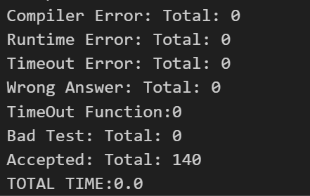

### 项目基本介绍
1. build.sh 是编译脚本   当在命令行中输入 ./build.sh 的时候就会编译项目，生成最终的项目在build 文件夹下的 compiler，可以去看一下 build.sh 都执行了哪些命令,是焦糖招新 基础知识 里面有写
2. yacc 下词法分析和语法分析的部分 
3. Value，Use，User 的核心类在 CoreClass 中 , CFG 中的BasicBlock 和 Function  在 CFG 中（相应的.hpp 和 .cpp文件中）
4. IR 文件夹下是数据流分析以及优化相关的内容, Opt 里面有 mem2reg，DCE，sccp 等优化

### 测试脚本
1. test.ipynb 是测试脚本会将 functional2025中的 .sy 后缀文件生成对应的 .ll 文件来验证正确性
2. 具体是怎么操作的了解一下, 其正确的输出为 

### 实现TailE的参考思路
1. test 文件夹下的 example 文件里面有一个给出的尾递归的简单样例，可以观察一下
2. 收集尾递归调用点
    * 在 collectTailCalls 里遍历函数所有 use，找到当前函数内部对自身的调用指令。
    * 检查调用是否紧跟在一个 ret 指令前（即 return f(...)）。
    * 检查返回值是否正好是调用结果（即真正的尾递归，而不是 return f(x)+1 这种情况）。
    * 符合条件的 (CallInst*, RetInst*) 记录下来。
3. 建立新的入口 / 循环结构
    * 在 AllocasRecord 中处理函数入口块
        * 找出所有参数初始化前的 alloca 区域
        * 把入口块一分为二：
            * allocBlock：保留所有 alloca，最后跳到新块
            * loopBlock：作为真正循环开始的地方
4. 参数改写为 Phi 节点
    * 在 run 里，对函数的每一个参数创建一个 phi 节点
    * 把原来参数的使用替换成 phi
    * phi 初始 incoming 值来自入口块（即原始实参）
5. 改写尾调用为循环跳转
    * 对每个尾递归调用 (call, ret)
        * 提取调用参数，把它们作为新的 incoming 值加入对应 phi 节点
        * 删除尾调用和 ret
        * 插入 br loopBlock（无条件跳转回循环）
6. 完成清理与标记
    * 把 phi 节点插入 loopBlock 前端
    * 格式化后保证 IR 合法
    * 标记函数为非递归（func->isRecursive(false)）

小提示：
1. include/lib/MyList.hpp 这个数据结构也是我们组织IR的一个关键核心点，里面的函数你会用到
2. BasicBlock class 中有已经写好的 SplitAt 函数，可以在splitInst 处分割基本块
3. 当你创建出了新的块后，需要维护基本块的链表（使用 MyList.hpp 中的接口，如 InsertAfter）
4. ReplaceAllUseWith() 将一个Value 用传入的 Value 值全部替换掉
5. PhiInst::addIncoming() 需要传入Value值和Value 值存在的基本块
6. InstReplace() 是语句的替换
7. FormatPhi() 是将phi函数直接合法化
8. isRecursive() 标记函数是否为递归

### 需要完成
1. 跑起这个项目，学会调试这个项目，配置launch.json 和 tasks.json
2. 了解 Value，Use，User 这套数据结构
3. 了解 Instuction BasicBlock Function 这些继承类
4. Tail 的实现思路相对来说是比较复杂的，且需要对这个代码结构较为熟悉
5. 如果自己对Tail有好的想法按照自己的想法来就好，不必要拘泥于形式
6. 如果实现了Tail 要在test.ipynb 中测试自己是否全部样例可以跑过，前提是确保你的优化被执行
7. 没有实现也是没有关系的，把自己的思考记录下来就好
    (如果存在问题请及时联系我，qq招新群：沧笙踏歌)
